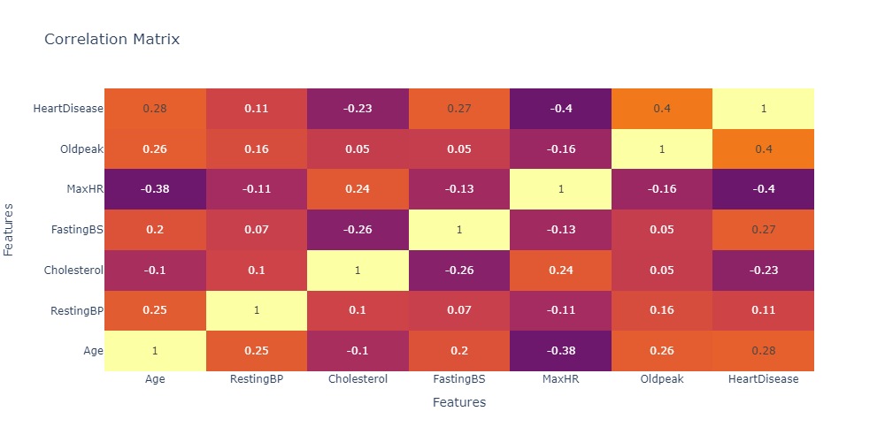

# A Comparative Study of Random Forest and K-Nearest Neighbors for Heart Failure Risk Prediction

## Project Domain

<b>Background:</b>

Heart failure occurs when the blood returning to the heart is in a normal state, meaning the blood has not been fully processed but the heart is unable to pump this normal blood to other parts of the body for metabolism [1]. According to the definition provided by the World Health Organization (WHO) in 2014, cardiovascular disease (CVD) is a disease caused by impaired heart and blood vessel function, such as coronary heart disease, hypertension, stroke, and heart failure disease. More than 36 million people die each year, accounting for 63% of all deaths [2]. 

Cardiovascular diseases (CVDs) stand as a formidable health challenge worldwide, comprising a spectrum of conditions that affect the heart and blood vessels. These encompass coronary artery disease, heart failure, stroke, and peripheral artery disease, among others. The intricate cardiovascular system, consisting of the heart, blood vessels, and blood, serves the vital function of transporting oxygen, nutrients, and waste products throughout the body. Within this system, the heart propels oxygen-rich blood to tissues via arteries, while veins return oxygen-depleted blood to the heart, with capillaries facilitating the exchange of substances between blood and tissues. Despite medical advancements, CVDs remain the leading cause of mortality globally, claiming millions of lives each year and accounting for a significant portion of all deaths. 

The cardiovascular system consists of blood vessels and the heart, which is the most important and most difficult to move muscle in the human body. The heart provides blood supply to every cell in the body [3]. This problem must be solved through a comprehensive approach that includes public education on healthy lifestyles, regular health check-ups for early detection, and equitable and affordable access to quality healthcare. In addition, supportive health policies, the use of advanced medical technologies, and multisectoral collaboration are needed to create a favorable environment for heart health and reduce the prevalence of cardiovascular diseases.

## Business Understanding

In the process of clarifying the problem, several problem statements have been identified as primary focuses, along with establishing goals to be achieved for each of these problem statements.

### Problem Statements 

- How to analyze patient data affected by heart failure disease?
- How to build a model that can predict heart failure or cardiovascular disease well?
- How to choose a model that can classify the heart failure disease well?

### Goals

- Analyze and process the optimal data to be well-received by the machine learning model and gather new information insights about patients who have heart failure disease based on the dataset.
- Build a model that can predict patients with heart failure disease from existing datasets.
- Compares 2 specific algorithms used in modeling and can predict diseases based on a pre-defined dataset well

### Solution Statements
- Analyze, explore, and process the data by visualizing the data to get an idea of how the data is. The following is the analysis that can be done:
  1. Handle missing values in the data
  2. Finding correlations in the data to find dependant variables and independent variables
  3. Handle outliers in the data using the IQR Method
  4. Normalizing the data especially for numeric features using standard scaler

- Create a classification model using K-Nearest Neighbors (KNN) and RandomForest classifier for determining heart failure patients based on a predefined dataset.

- Compare the two algorithms based on the evaluation results using the evaluation metrics of each algorithm and determine the best model that can predict heart failure.

## Data Understanding

Cardiovascular diseases (CVDs) stand as the primary cause of mortality on a global scale, claiming an estimated 17.9 million lives annually, which amounts to 31% of all deaths worldwide. A staggering four out of five CVD-related deaths stem from heart attacks and strokes, with a significant portion occurring prematurely, affecting individuals under the age of 70. Heart failure, a common consequence of CVDs, underscores the urgency for early detection and management. This dataset encompasses 12 features that offer potential insights for predicting the likelihood of heart disease.

### Dataset Reference:

- [UCI Machine Learning Repository](https://archive.ics.uci.edu/dataset/45/heart+disease) (13 Features [Raw] )
- [Kaggle](https://www.kaggle.com/datasets/fedesoriano/heart-failure-prediction) (12 Features [Cleaned] )

### Variables in Heart Failure Dataset:
1. `Age`: age of the patient [years]
2. `Sex`: sex of the patient [M: Male, F: Female]
3. `ChestPainType`: chest pain type [TA: Typical Angina, ATA: Atypical Angina, NAP: Non-Anginal Pain, ASY: Asymptomatic]
4. `RestingBP`: resting blood pressure [mm Hg]
5. `Cholesterol`: serum cholesterol [mm/dl]
6. `FastingBS`: fasting blood sugar [1: if FastingBS > 120 mg/dl, 0: otherwise]
7. `RestingECG`: resting electrocardiogram results [Normal: Normal, ST: having ST-T wave abnormality (T wave inversions and/or ST elevation or depression of > 0.05 mV), LVH: showing probable or definite left ventricular hypertrophy by Estes' criteria]
8. `MaxHR`: maximum heart rate achieved [Numeric value between 60 and 202]
9. `ExerciseAngina`: exercise-induced angina [Y: Yes, N: No]
10. `Oldpeak`: oldpeak = ST [Numeric value measured in depression]
11. `ST_Slope`: the slope of the peak exercise ST segment [Up: upsloping, Flat: flat, Down: downsloping]
12. `HeartDisease`: output class [1: heart disease, 0: Normal]

### Visualization and Explanatory Data Analysis

To understand heart disease data, visualization is done using bar charts and pie charts. In visualizing it, Univariate Analysis and Multivariate Analysis were performed. For the whole, the dataset is divided into two features, namely categorical features and numerical features. For features in the numerical data type contains: 'Age', 'RestingBP', 'Cholesterol', 'MaxHR', 'Oldpeak'. Meanwhile, the features in the categorical data type contains: 'Sex', 'ChestPainType', 'FastingBS', 'RestingECG', 'ExerciseAngina', 'ST_Slope' and 'HeartDisease'. Below is a visualization and explanation of univariate and multivariate analysis including:

### Univariate Analysis

**Univariate Analysis - Categorical Features**

1. Heart Disease Distribution and Percentages

  

From the results of the graph above, it can be concluded that the dataset contains 55.4% or around 508 patient data affected by heart failure disease and 44.7% or around 410 patient data, which means that more than 50% of patients are affected by heart failure disease based on the dataset.

2.  Sex Distribution and Percentages

  

From the results of the graph above, it can be concluded that the dataset contains 79% or around 725 patient data affected by heart failure disease is male and 21% or around 193 patient data is female, which means that patients affected by heart failure disease based on the dataset are mostly male.

3. Chest Pain Type Distribution and Percentages

  

From the results of the graph above, it can be concluded that the dataset contains 54% or around 496 experiencing chest pain of the ASY type, 22.1% or around 203 of the ATA type, 18.8% or around 173 of the NAP type and 5.01% of the TA type which means that many patients with heart failure disease experience chest pain of the ASY type.

4. Angina Distribution and Percentages

  

From the results of the graph above, it can be concluded that the dataset contains 59.6% or about 547 patients affected by angina and 40.4% or about 371 patients not affected by angina, which means that patients affected by angina should be vigilant because angina can be an indicator of heart failure.

5. ST Slope Distribution and Percentages

  

From the results of the graph above, it can be concluded that the dataset contains 50.1% or about 460 have ST slope 'Flat', 43% or about 395 have ST slope type 'Up' and 6.86% or about 63 ST slope 'Down', which means that patients affected by heart failure mostly have ST slope type 'Flat'. (in total 99.96%)

**Univariate Analysis - Numeric Features**

The following is an overview of the distribution in the numeric categories which include 'Age', 'RestingBP', 'Cholesterol', 'MaxHR', 'Oldpeak'.

  

  

  

  

  

  

### Multivariate Analysis

1. Variables Correlations

  
  

From the results of the correlation matrix above, it states that there is no close relationship between variable x and variable y where there is only a relationship between each variable with the same name. The graph also explains that the highest correlation between different variables is 'HeartDisease' and 'OldPeak' with a value of 0.4. In conclude there is no strong relationship between the variables.

2. Analysis of Other Features Against 'HeartDiease' Features

The following is an overview of the feature analysis of the features in the dataset against the 'HeartDiseases' feature

  

From the results of the graph analysis above, it can be concluded that the most affected by heart failure disease are patients who are male.

  

From the results of the graph analysis above, it can be concluded that the most affected by heart failure disease are patients who have ST_slope type 'Flat' while those who are not affected by heart failure disease are patients who have ST_slope type 'Up'.

  

From the results of the graph analysis above, it can be concluded that many patients affected by heart failure disease have 'RestingECG' with normal levels while those who are not affected by heart failure disease also have normal 'RestigECG', meaning that it is not determined that someone has heart disease based on the 'RestingECG' variable.

  

From the results of the graph analysis above, it can be concluded that many patients affected by heart failure disease have 'FastingBS' more than 300 while those who are not affected by heart failure disease also have 'FastingBS' more than 300, meaning that it is not determined that someone has heart disease based on the 'FastingBS' variable.

  

From the results of the graph analysis above, it can be concluded that many patients affected by heart failure are patients affected by angina.

  

From the results of the graph analysis above, it can be concluded that patients who have a lot of heart failure disease are patients who have chest pain of the 'ASY' type.

## Data Preparation

Data preparation is a critical stage in the process of developing machine learning models, involving the 
transformation of data into a form suitable for modeling. 
This stage encompasses several key steps, including data selection, outliers handling, data splitting, data normalization

1. <b>Data Selection</b>

    

      Data selection is the initial stage carried out before entering the part of creating a model. Where the data will be cleaned and filled in if there are still deficiencies in the dataset. Then the selected data will be used in modeling. Data needs to be selected so that there is no balance of data that can affect the performance of a model because that is why data selection must be done.
    

2. <b>Outliers Handling</b>
    

      Outliers are data points that deviate significantly from the majority of the data. They can occur due to variability in the data, errors in data collection, or they may represent anomalies that are of particular interest. Handling outliers is a crucial step in data preprocessing because outliers can significantly skew and mislead statistical analyses and machine learning models. In this project, outliers will be removed by the IQR method. the following is the formula for IQR:

      $$IQR=Q3−Q1$$

      Variables:
      - Q1 (the first quartile) is the median of the lower half of the dataset (25th percentile).
      - Q3 (the third quartile) is the median of the upper half of the dataset (75th percentile).

      Outliers can significantly affect machine learning models. Models trained with data containing outliers may produce biased or inaccurate predictions. This is the reason why outliers must be removed but outliers can also hold important values from a dataset therefore care must be taken in removing them.
    

    
3. <b>Data Splitting</b>
    

      Dividing a dataset into train and test is an important step in building a machine learning model. This division has several main objectives:

      1. Accurately measure model performance

          Splitting a dataset into train and test allows for accurate measurements of how a model will perform on never-before-seen data. This provides a realistic picture of the model's performance in the real world, where the model will operate on data that was not seen during training.

      2. Prevent Overfitting

          Overfitting occurs when the model is too fit to the training data so that it loses the ability to generalize to new data. By having a separate dataset for testing, it can be identified whether the model is overfitting by comparing performance on training data and testing data. If the model performs very well on the training data but poorly on the testing data, it is an indication of overfitting.

      3. Evaluate Model Generalization
      
          The main goal of a machine learning model is to be able to generalize from training data to new, unseen data. Test data provides a way to evaluate how well the model can generalize. A good model should have similar performance on both training and testing data.

      4. Provide Benchmarks for Models

          By dividing the dataset into train and test, objective benchmarks can be established to compare different models or model configurations. This helps in the process of selecting the best model based on performance on test data.
    

4. <b>Data Normalization</b>

    

      Dataset normalization, especially using the Z-score method, is an important process in data preprocessing for machine learning and statistical analysis. Z-score normalization changes the values ​​in the dataset so that they have a mean (average) of 0 and a standard deviation of 1. The following are the reasons why this normalization process needs to be carried out and the z-score formula:

      $$
      Z = \frac{x - \mu}{\sigma}
      $$

      Variables:
      - $x$ is the value,
      - $μ$ is the mean of the population,
      - $σ$ is the standard deviation of the population.
    

    

      1. Improve Model Performance

          Machine learning models, especially distance-based ones such as K-Nearest Neighbors (KNN) and gradient-based algorithms such as linear regression, are strongly influenced by feature scale. Normalization with Z-score ensures that all features contribute proportionally to the final result, so the model can perform better.

      2. Improve Model Stability and Accuracy
          
          By converting data to a uniform scale, normalization helps in improving the stability and accuracy of the model. The model becomes more robust and less easily affected by unwanted variations in the data.

      3. Eliminate Skewness
      
          Normalization with z-score helps remove skewness from data distribution. This makes the data more symmetrical and better fits the assumptions of many machine learning algorithms that rely on normal or near-normal distributions.
    

## Modeling

This stage discusses the machine learning model used to solve the problem. This process is carried out using two algorithms, namely K-Nearest Neighbors (KNN) and RandomForest. The final result is to find the algorithm that has the best performance of the two algorithms used.

1. K-Nearest Neighbors is a machine learning algorithm that works by classifying new data using the similarity between the new data and a number of data (k) in existing data. This algorithm can be used for classification and regression. There is only 1 hyperparameter used in this model, namely:

    - `n_neighbors`: The number of neighbors needed to locate new data

    Advantages of KNN Algoritm:

    - Simplicity: kNN is easy to understand and implement. It does not require training a model in the traditional sense, making it suitable for quick prototyping and straightforward problems.

    - No Assumptions About Data Distribution: kNN does not make any assumptions about the underlying data distribution. It can handle nonlinear data and complex decision boundaries effectively.

    - Versatility: kNN can be applied to both classification and regression problems. It can handle both discrete and continuous data, making it versatile in various domains.

    - Interpretability: The predictions made by kNN are relatively easy to interpret. It operates on the principle that similar data points tend to have similar labels, making its decisions intuitively understandable.

    - Non-parametric: kNN is a non-parametric algorithm, meaning it does not make assumptions about the functional form of the underlying data. This flexibility allows it to adapt to different types of datasets.

    Disadvantages of KNN Algorithm:

    - Computational Complexity: As the size of the dataset grows, the computational cost of kNN can become significant. Since kNN requires calculating distances between the query point and all training points, it can be slow for large datasets, especially in high-dimensional spaces.

    - Memory Intensive: kNN requires storing the entire training dataset in memory, as it needs to compare new instances with all existing instances during prediction. This can be memory-intensive, especially for large datasets.

    - Sensitive to Irrelevant Features: kNN considers all features equally when calculating distances. It can be sensitive to irrelevant or noisy features, leading to degraded performance if the dataset contains irrelevant information.

    - Need for Optimal k-value Selection: The choice of the parameter k (the number of nearest neighbors) can significantly impact the performance of the kNN algorithm. Selecting an optimal value for k requires experimentation and may vary depending on the dataset and problem.

    - Imbalanced Data: In classification tasks with imbalanced class distributions, kNN tends to favor the majority class, as it predicts based on the most common class among the k nearest neighbors. This can lead to biased predictions in favor of the majority class.

2. Random Forest is a versatile and powerful ensemble learning algorithm used for classification and regression tasks in machine learning. It operates by constructing multiple decision trees during training and outputs the mode (for classification) or the mean prediction (for regression) of the individual trees.This algorithm can be used for classification and regression. There is only 1 hyperparameter used in this model, namely:

    - `n_estimators`: refers to the number of decision trees that are created in the ensemble

    Advantages OF RandomForest Algorithm:

    - High Accuracy: Random Forest typically produces highly accurate models for both classification and regression tasks. It combines the predictions of multiple decision trees, reducing the risk of overfitting and improving generalization performance.

    - Robustness to Overfitting: By aggregating the predictions of multiple decision trees trained on different subsets of the data, Random Forest mitigates overfitting. This makes it less sensitive to noise and outliers in the data compared to individual decision trees.

    - Feature Importance: Random Forest provides a measure of feature importance, indicating the contribution of each feature to the model's predictive performance. This information can be valuable for feature selection and understanding the underlying patterns in the data.

    - Handles Missing Values: Random Forest can handle missing values in the dataset without requiring imputation. It includes them in the splitting process and computes impurity measures accordingly.

    - Efficient on Large Datasets: Random Forest is parallelizable and can efficiently handle large datasets with many features and instances. It can be trained in parallel on multiple CPU cores or distributed computing environments.

    - Reduction of Bias and Variance: The averaging of predictions from multiple trees in Random Forest helps to reduce bias and variance, leading to more stable and reliable predictions.

    Disadvantages of RanfomForest Algorithm:

    - Lack of Interpretability: Despite providing feature importance measures, the individual decision trees within a Random Forest are not easily interpretable on their own. Understanding the reasoning behind specific predictions can be challenging compared to simpler models like decision trees.

    - Computational Complexity: Random Forest can be computationally expensive, especially for large datasets with many trees and features. Training and predicting with Random Forest may require more computational resources and time compared to simpler algorithms.

    - Model Size: The ensemble nature of Random Forest means that the final model can be large, especially when using a large number of trees or when dealing with high-dimensional data. This can increase memory requirements for storing the model.

    - Hyperparameter Tuning: Random Forest has several hyperparameters that need to be tuned for optimal performance, such as the number of trees (n_estimators) and the maximum depth of each tree (max_depth). Finding the optimal hyperparameters requires experimentation and computational resources.

    - Bias Towards Majority Class: In imbalanced classification tasks, Random Forest may exhibit bias towards the majority class, especially when the class distribution is highly skewed. Techniques like class weighting or resampling may be necessary to address this issue.

## Evaluation

  In this project, standard evaluation metrics for classification problems are used, including precision, recall, F1-score, and accuracy. Precision measures how many of the instances predicted as positive by the model are actually positive, while recall measures how many of the true positive instances the model successfully predicted. F1-score is the harmonic average of precision and recall, providing a balance between the two. Accuracy measures how many of all predictions a model makes correctly. In the context of classification, it is important to consider all these metrics together to gain a complete understanding of model performance. These metrics provide a comprehensive picture of the accuracy, completeness, and balance between models in classifying data. By checking precision, recall, F1-score, and accuracy, it can be evaluated how well the model functions in identifying different classes and understanding the strengths and weaknesses of each model in carrying out classification. The following is an explanation of the evaluation metrics used, including:

  
  1. Accuracy
  
      Accuracy metrics serve to measure how many of all correct predictions were made by the model.

      Formula:

      $$
      \text{Accuracy} = \frac{TP + TN}{TP + TN + FP + FN}
      $$
      
      - $TP$ (True Positive): The number of instances correctly predicted as positive.
      - $TN$ (True Negative): The number of instances correctly predicted as negative.
      - $FP$ (False Positive): The number of instances that were incorrectly predicted as positive.
      - $FN$ (False Negative): The number of instances that were incorrectly predicted as negative.

  2. Precision
  
      Precision measures how many of the instances predicted as positive by the model are actually positive. This provides insight into how reliable the model is

      Formula:

      $$
      \text{Precision} = \frac{TP}{TP + FP}
      $$
      
      - $TP$ (True Positive): The number of instances correctly predicted as positive.
      - $FP$ (False Positive): The number of instances that were incorrectly predicted as positive.

  3. Recall
  
      Recall (or also known as sensitivity) measures how many of the truly positive instances the model successfully predicted. This provides an understanding of how well the model can identify positive cases.

      Formula:

      $$
      \text{Recall} = \frac{TP}{TP + FN}
      $$
      
      - $TP$ (True Positive): The number of instances correctly predicted as positive.
      - $FN$ (False Negative): The number of instances that were incorrectly predicted as negative.
  
  4. F1 - Score
  
      F1-score is the harmonic average of precision and recall, providing a balance between the two. This is useful when classes are unbalanced.

      Formula:

      $$
      F1 = 2 \times \frac{\text{Precision} \times \text{Recall}}{\text{Precision} + \text{Recall}}
      $$
      

### Metrics Calculation Result

    

Based on the results of the previous graph, the graph shows the performance results of the KNN and RF models using accuracy, precision, recall, and F1-score metrics. Where the model with RF has all metrics with perfect values (100.00%) in the train set. But on the test set the model with KNN is slightly superior to the model using the RF algorithm. By using these metrics, more in-depth information can be obtained about the ability of the two models to perform classification. The following is an explanation that can be taken from the graph:

 

| Dataset | KNN Accuracy | KNN F1 Score | KNN Precision | KNN Recall |
|---------|--------------|--------------|---------------|------------|
| Train   | 0.893048     | 0.893082     | 0.893138      | 0.893048   |
| Test    | 0.907801     | 0.907792     | 0.907874      | .907801    |

 

| Dataset | RF Accuracy | RF F1 Score | RF Precision | RF Recall |
|---------|-------------|-------------|--------------|-----------|
| Train   | 1.000000    | 1.000000    | 1.000000     | 1.000000  |
| Test    | 0.900709    | 0.900709    | 0.900709     | 0.900709  |

 

  1. Accuracy:

      - KNN Train Accuracy: 0.893048 (89.30%) - The KNN model classified 89.30% of the data correctly in the train set.

      - KNN Test Accuracy: 0.907801 (90.78%) - The KNN model classified 90.78% of the data correctly in the test set.

      - RF Train Accuracy: 0.100000 (100%) - The RF model classified 100% of the data correctly in the train set.

      - RF Test Accuracy: 0.900709 (90.07%) - The RF model classified 90.07% of the data correctly in the test set.

      - In general, RF has perfect accuracy than KNN on the train set. But in the test set KNN is slightly better than RF

  2. Precision:

      - KNN Precision: 0.893138 (89.31%) - Of all the data classified as positive by KNN in the train set, 89.31% were true positive.

      - KNN Precision: 0.907874 (90.78%) - Of all the data classified as positive by KNN in the test set, 89.31% were true positive.

      - RF Precision: 0.100000 (100.00%) - Of all the data classified as positive by RF in the train set, 100.00% were true positive.

      - RF Precision: 0.900709 (90.07%) - Of all the data classified as positive by RF in the test set, 90.78% were true positive.
      
      - Similar to accuracy, RF has a perfect precision than KNN on the train set. But in the test set KNN is slightly better than RF

  3. Recall:

      - KNN Recall: 0.893048 (89.30%) - KNN succeeded in identifying 89.30% of positive data in the train set.

      - KNN Recall: 0.907801 (90.78%) - KNN succeeded in identifying 90.78% of positive data in the test set.

      - RF Recall: 0.100000 (100.00%) - RF successfully identified 100.00% of positive data in the train set.

      - RF Recall: 0.900709 (90.07%) - RF successfully identified 90.07% of positive data in the test set.

      - Again, RF shows a perfect performance in identifying positive data than KNN on the train set. But again, in the test set KNN is slightly better than RF

  4. F1 Scores:
      - KNN F1: 0.893082 (89.31%) - KNN F1 score shows a good balance between precision and recall but is lower than RF F1 Score which is 100% in train set.
      - KNN F1: 0.0.907792 (90.77%) - KNN F1 score shows a good balance between precision and recall than RF in test set.
      - RF F1: 0.100000 (100.00%) - RF's F1 score is perfect, indicating better overall model performance in train set.
      - RF F1: 0.900709 (90.07%) - RF's F1 score is slightly lower than KNN in test set.

The table below presents information on the prediction results of the models used. From the table it can be seen the comparison between the model with the KNN algorithm and the model with the RF algorithm in predicting test and train data. the following is the table:

 

**Test Prediction:**

| Test True Y | KNN Prediction | RF Prediction |
|-------------|----------------|---------------|
| 0           | 0              | 0             |
| 1           | 1              | 1             |
| 1           | 1              | 1             |
| 0           | 0              | 0             |
| 1           | 1              | 1             |
| 1           | 1              | 1             |
| 0           | 0              | 1             |
| 0           | 1              | 1             |
| 0           | 1              | 0             |
| 1           | 1              | 1             |

 

**Train Prediction:**

| Train True Y | KNN Prediction | RF Prediction |
|--------------|----------------|---------------|
| 1            | 1              | 1             |
| 0            | 0              | 0             |
| 0            | 0              | 0             |
| 1            | 1              | 1             |
| 1            | 1              | 1             |
| 0            | 0              | 0             |
| 0            | 0              | 0             |
| 1            | 1              | 1             |
| 0            | 0              | 0             |
| 0            | 0              | 0             |

**Conclusion:**

   It can be concluded from the analysis and table results above, the RF model shows better performance than KNN in terms of accuracy, precision, recall, and F1 score on the train set. Meanwhile, on the test set, the KNN model is much better at predicting. Therefore, the RF model is determined to be superior to KNN because it can predict the train set perfectly (100% accuracy) and the difference in predicting the test set data is not too large with the KNN model. Therefore, the model with RF algorithm is used as a superior model in predicting the disease.

## References

  [1] S. Adi and A. Wintarti, “KOMPARASI METODE SUPPORT VECTOR MACHINE (SVM), K-NEAREST NEIGHBORS (KNN), DAN RANDOM FOREST (RF) UNTUK PREDIKSI PENYAKIT GAGAL JANTUNG,” MATHunesa: Jurnal Ilmiah Matematika, vol. 10, no. 2, pp. 258–268, Jul. 2022, doi: https://doi.org/10.26740/mathunesa.v10n2.p258-268.
  
  [2] D. Reza, A. Siregar, and R. Rahmat, “Penerapan Algoritma K-Nearest Neighbord untuk Prediksi Kematian Akibat Penyakit Gagal Jantung,” Scientific Student Journal for Information, Technology and Science, vol. 3, no. 1, pp. 105–112, Jan. 2022, Accessed: Jun. 02, 2024. [Online]. Available: https://journal.ubpkarawang.ac.id/mahasiswa/index.php/ssj/article/view/428
  
  [3] Z. Masetic and A. Subasi, “Congestive heart failure detection using random forest classifier,” Computer Methods and Programs in Biomedicine, vol. 130, pp. 54–64, Jul. 2016, doi: https://doi.org/10.1016/j.cmpb.2016.03.020.
‌

